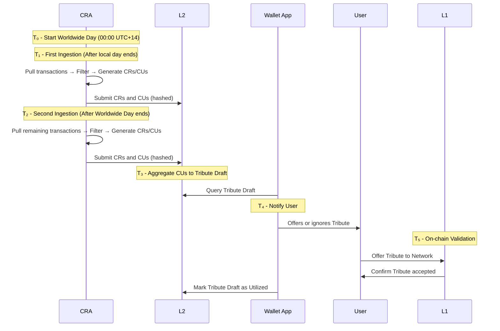
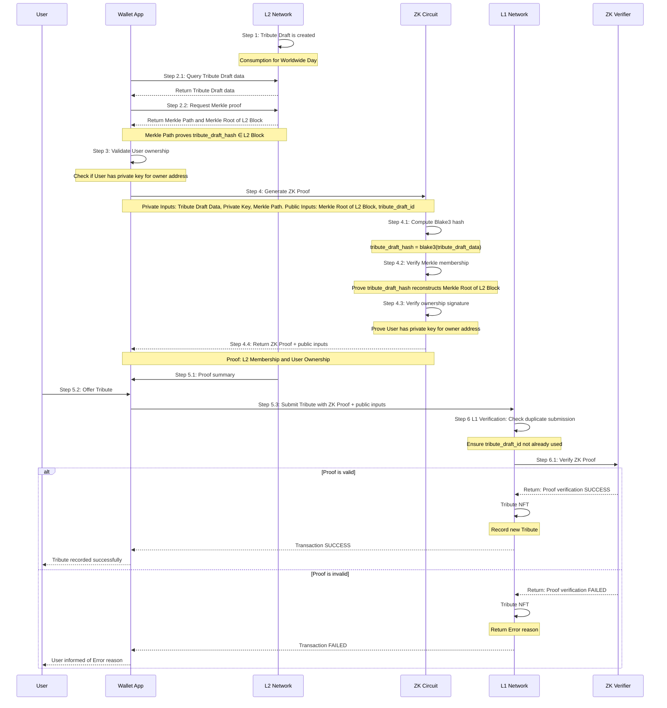

# Reflection of Acts of Consumption

**June 2025**

## 1. Abstract

Consumption Unit (CU) is a data structure representing a bundle of a User’s Acts of Consumption for a given Worldwide Day and User’s Bank Account. Each CU is generated by a Consumption Reflection Agent (CRA) through the aggregation of eligible Consumption Records (CRs) and submitted to L2 Network. Each CR reflects a specific Act of Consumption, is verified, valued in Settlement Currency and coen, and its hash is recorded in CU. CR hash is used to enforce uniqueness and prevent duplication of CR across Network. Once recorded, CU becomes immutable and is the basis for the forming of Tribute Draft on L2 Network. Wallet App retrieves formed Tribute Draft. Then User offers Tribute on L1 Network via Wallet App.   

## 2. System Logic 

### **Consumption Record (CR)**

The Consumption Reflection Agent (CRA) retrieves raw financial transaction data from a User’s Bank Account via valid data sources (e.g. Open Banking APIs or direct integrations with financial institutions).

CRA ingests data at least twice per Worldwide Day:

- First ingestion occurs after the CRA’s local day ends and covers transactions from the start of the Worldwide Day (00:00 UTC+14) to the end of the CRA’s local day.
- Second ingestion begins after the Worldwide Day ends and captures any remaining transactions, from 00:00 of the CRA’s next local day to the end of Worldwide Day 23:59 UTC–12.

During each ingestion, the CRA:

- Filters transactions using eligibility rules (e.g. personal account type, valid merchant categories).
- Normalises and transforms each transaction into a Consumption Record (CR) according to the CR schema.
- Converts Consumption Value of each Act of Consumption into both Settlement Currency and coen, using the Network Price Feed Oracle at the time Act of Consumption occurred.
- Calculates balances of refunds as negative-value CRs.
- Generates a cryptographic hash for each CR.
- Creates CR in accordance with CR Schema (Appendix B).

The Settlement Currency is defined by the User per Account via the Wallet App. Any change to the Settlement Currency takes effect on the next Worldwide Day, while the ongoing day continues using the previously assigned Settlement Currency. If Settlement Currency for Account is not defined, CRA chooses the Settlement Currency.

CRA manages Consents, which are explicit user authorizations permitting access to their financial transaction data via regulated APIs. CRA obtains Consent from User, typically involving redirection to a secure bank or third-party interface where User approves the data access request. Once received, CRA stores and tracks the Consent's status (active, revoked, expired, or pending), ensuring compliance with regional data access laws.

### **Consumption Unit (CU)**

CUs are bundles of CRs aggregated per User's Bank Account and Worldwide Day.

Each CU:

- Created in accordance with CU Schema (Appendix C).
- Aggregates the total amount in both Settlement Currency and coen.

CUs are immutable post-signing and subject to Network deduplication. Deduplication means that Network verifies each Consumption Record (CR) included in a Consumption Unit (CU) has not already been recorded in another CU. This is enforced by checking the CR hash, which uniquely identifies each Act of Consumption. If a CR hash already exists in a previously submitted CU, the new CU is rejected. This mechanism ensures that the same Act of Consumption cannot be counted more than once across multiple Accounts, preventing double submissions.

### **Tribute Draft**

Tribute Drafts are automatically created on the L2 Network by aggregating Consumption Units (CUs) per Account and Worldwide Day. They serve as the pre-stage of any Tribute offered on L1. 

Tribute Draft is created on L2 Network before Tribute is offered on L1. 

### 3. Aggregation Rules

| Rule | Description |
| --- | --- |
| Aggregation | CRs Settlement Amount is aggregated to CU per User's Bank Account and Worldwide Day. |
| Account type | Personal Account. |
| Eligibility | Only merchant transactions, no intra-user transfers. |
| Refunds | Tracked as negative CRs. |
| Signing Flow | CRA signs and submits CUs to L2, CUs are aggregated to form Tribute Drafts on L2 →  Tribute is formed via Wallet App based on Tribute Draft data. User offers Tribute via Wallet App. |
| Deduplication | CRs must be unique. |

CR aggregation is collecting multiple CRs and combining them into CUs that aggregate the total value of consumption for a specific Worldwide Day and Bank Account.

It includes:

- Grouping all CRs matching the same User's Bank Account and Worldwide Day. 
- Summing values (total settlement_amount).
- Producing signed CUs from that set.

### CRA Implementation Principles

- Refund logic must reconcile past CRs by recording a corresponding negative CR in a subsequent CU, with a reference to the original CU and its Worldwide Day.
- CRA must be able to recognize and reflect anomalous activity and fraud patterns as part of its processing logic.
- CRs, CUs creation is performed by CRA on L2 Network.
- Tribute Draft is created on L2.
- User offers Tribute to L1 and signs it in Wallet App.

## 4.System Objects

### Storage state structure overview for L2 Smart Contracts 

**Consumption Record (CR)**

| Attribute | Type | Description |
| --- | --- | --- |
| cr_id | String | see hashing  |
| metadata | Map[String,String] | A flexible key value store for additional contextual attributes, tags, or supplementary data related to the object. |

**Consumption Unit (CU)**

| Attribute | Type | Description |
| --- | --- | --- |
| cu_id | String | see hashing |
| worldwide_day | Date | Worldwide Day. |
| owner | String | Address on L2 Network associated with User. |
| cr_hashes | [String] | array of cr_id. |
| metadata | Map[String,String] | A flexible key value store for additional contextual attributes, tags, or supplementary data related to the object. |

**Tribute Draft** 

| Attribute | Type | Encrypted | Description |
| --- | --- | --- | --- |
| tribute_draft_id** | String |  | see hashing  |
| created_at | Integer | X | date-time as timestamp. |
| worldwide_day | String | X | date, ISO 8601. |
| settlement_currency | String | X | currency used for Settlement Currency, ISO 4217. |
| settlement_amount_base | Integer | X | Amount in Settlement Currency, expressed in natural units (e.g., 48). |
| settlement_amount_atto | Integer | X | Fractional amount in Settlement Currency, in atto-units (e.g., 0.07 = 70000000000000000000). |
| cu_hashes | [String] | X | array of cu_id. |

### Hashing

Hashing algorithm is Blake3.

**Consumption Record**

Each CR must have a unique hash, derived from the following attributes, and submitted by CRA in hashed form to L2

| Field | Description |
| --- | --- |
| bank_account_hash| User's Account details hash (blake3(bic + iban or bban). |
| registered_at| Time when the financial institution registered the transaction, time precision seconds, timezone strictly UTC, ISO 8601. |

**Consumption Unit**

Each CU must have a unique hash, derived from the following attributes, and submitted and signed by CRA in hashed form to L2.

| Field | Description |
| --- | --- | 
| bank_account | User's account details hash (blake3(bic + iban or bban). |
| worldwide_day | Worldwide Day. |
| last_cr_hash | Hash of the latest CR in CU. |

**Tribute Draft** 

Each Tribute Draft must have a unique hash derived from the following attributes.

| Field | Description | 
| --- | --- |
| owner | Address on L2 Network associated with User. |
| worldwide_day | Worldwide Day Tribute was offered to L1 Network for. | 
| list of CU.hashes | Ordered list of hashes of the Consumption Units (CUs) that are being associated with Tribute Draft. | 

## 5. Appendix

### Appendix A States

CU hash is submitted by CRA on L2 and checked for duplication. When CU hash is accepted by the Network, it will be included in the Tribute Draft for Worldwide Day, reflecting all Users' Acts of Consumption for this day.

| Object | Status |
| --- | --- |
| Tribute Draft on L2 | Created, Utilized. |

### Appendix B **Consumption Record (CR) Schema**

```javascript
consumption_record:
  type: object
  description: Represents a payment transaction between User and merchant according to PSD2 standards
  required:
    - transaction_id
    - owner
    - bank_account_hash
    - registered_at
    - timezone
    - settlement_currency
    - settlement_amount_base
    - settlement_amount_atto
    - settlement_price
    - status
    - settlement_date
    - merchant_name
    - merchant_id
    - merchant_category_code
    - payment_method
    - reference
    - location
    - transaction_type
    - transaction_amount

  properties:
      
    transaction_id:
      type: string
      description: Unique identifier for the transaction reference number from User's Bank Account, TRN
      example: "TX1234567890"

    owner:
      type: string
      description: Address of Account
      example: 0x1234abcd5678ef901234abcd5678ef901234abcd
    
    bank_account_hash:
      type: string
      description: The User's Bank Account details hash (blake3(bic + iban || bban)
      example: "a1b2c3d4e5f6789012345678901234567890abcdef1234567890abcdef123456"  
    
    registered_at:
      type: string
      format: date-time
      description: Date and time when the transaction was initiated in local timezone, time precision seconds, timezone strictly UTC, ISO 8601
      example: "2025-06-07T10:00:45Z"
      
    timezone:
      type: string
      description: Time zone offset from UTC in ±HH:MM format at the time the consumption took place.
      example: "+05:30"
      
    settlement_currency:
      type: string
      description: Currency used as Settlement Currency, ISO 4217 Alpha 3 currency code.
      example: "USD"

    settlement_amount_base:
      type: integer
      description:  Amount of the Consumption Record in Settlement Currency. Calculated as transaction amount / settlement price. Integer part, expressed in natural units.
      example: 1

    settlement_amount_atto: 
      type: integer
      description: Amount of the Consumption Record in Settlement Currency. Fractional part, in atto-units. 
      example: 440000000000000000 # 0.44 

    settlement_price:
      type: integer
      description: Price of 1 unit of settlement currency denominated in transaction currency, expressed in base.atto. Used to convert transaction_amount into the settlement amount.
      example: 85916666700000000000  # 85.9166667 INR per 1 USD (settlement currency).
      
    status:
      type: string
      enum:
        - COMPLETED
        - PENDING
        - DECLINED
        - REFUNDED
      description: Current status of the transaction
      example: "COMPLETED"
          
    settlement_date:
      type: string
      format: date-time
      description: Date and time when the transaction was settled
      example: "2025-06-07T10:15:22Z"
    
    merchant_name:
      type: string
      description: Name of the merchant
      example: "BigBasket"
    
    merchant_id:
      type: string
      description: Unique identifier for the merchant
      example: "MERCH-ID-9876"
    
    merchant_category_code:
      type: string
      description: Merchant category code as defined by card payment systems (MCC).
      example: "5411"
    
    payment_method:
      type: object
      description: Payment method used for the transaction
      required:
        - type
      properties:
        type:
          type: string
          enum:
            - CARD
            - BANK_TRANSFER
            - WALLET APP
            - OTHER
          description: Type of payment method used
          example: "CARD"
        masked_pan:
          type: string
          description: Masked card number (for card payments)
          example: "****-****-****-1234"
        card_type:
          type: string
          description: Type of card used (for card payments)
          example: "DEBIT"
        wallet_app_provider:
          type: string
          description: Provider of the digital wallet app (for wallet app payments).
          example: "APPLE_PAY"
    
    reference:
      type: string
      description: Reference information for the transaction.
      example: "POS-PURCHASE-12345"
    
    location:
      type: object
      description: Location where the transaction took place
      properties:
        city:
          type: string
          description: City where the transaction occurred
          example: "Delhi"
        country:
          type: string
          description: Country code where the transaction occurred
          example: "IN"
    
    transaction_type:
      type: string
      enum:
        - PURCHASE
        - REFUND
        - AUTHORIZATION
        - CAPTURE
        - VOID
        - PRE_AUTHORIZATION
        - RECURRING
        - INSTALLMENT
        - CASH_ADVANCE
        - BALANCE_TRANSFER
        - FEE
      description: >
        Type of the transaction that indicates its purpose and processing flow:
        * PURCHASE - Standard purchase of goods or services
        * REFUND - Return of funds to the user for a previous transaction
        * AUTHORIZATION - Initial hold of funds without actual transfer (pending transaction)
        * CAPTURE - Completion of a previously authorized transaction
        * VOID - Cancellation of a transaction before settlement
        * PRE_AUTHORIZATION - Reserved funds for future transactions (like hotel or car rental)
        * RECURRING - Regular payment based on an agreement (subscription)
        * INSTALLMENT - Part of a series of scheduled payments for a single purchase
        * CASH_ADVANCE - Cash withdrawal using a payment card
        * BALANCE_TRANSFER - Moving funds between accounts
        * FEE - Service charge from merchant or payment provider
      example: "PURCHASE"
      
      transaction_amount:
      type: object
      properties:
        transaction_amount_base:
          type: integer
          description: Integer part of the transaction amount, in natural currency units. Represents the whole-number portion.
          example: 123
        transaction_amount_atto:
          type: integer
          description: Fractional part of the transaction amount, expressed in atto-units. 
          example: "720000000000000000"  # 0.72 * 10^18
        currency:
          type: string
          pattern: "^[A-Z]{3}$"
          description: ISO 4217 Alpha 3 currency code
          example: "INR"
```

**Example of Consumption Record**

```javascript
{
  "transaction_id": "TX1234567890",
  "owner": "0x1234abcd5678ef901234abcd5678ef901234abcd",
  "bank_account_hash": "a1b2c3d4e5f6789012345678901234567890abcdef1234567890abcdef123456",
  "registered_at": "2025-06-07T10:00:45Z",
  "timezone": "+05:30",
  "settlement_currency": "USD",
  "settlement_amount_base": 1,
  "settlement_amount_atto": 440000000000000000,
  "settlement_price": 11640000000000000,
  "status": "COMPLETED",
  "settlement_date": "2025-06-07T10:15:22Z",
  "merchant_name": "BigBasket",
  "merchant_id": "MERCH-ID-9876",
  "merchant_category_code": "5411",
  "payment_method": {
    "type": "CARD",
    "masked_pan": "****-****-****-1234",
    "card_type": "DEBIT"
  },
  "reference": "POS-PURCHASE-12345",
  "location": {
    "city": "Delhi",
    "country": "IN"
  },
  "transaction_type": "PURCHASE",
  "transaction_amount": {
    "transaction_amount_base": 123,
    "transaction_amount_atto": "720000000000000000",
    "currency": "INR"
  }
}

```

On June 7, 2025 (worldwide day: 2025-06-07), a user in Delhi (UTC+05:30) purchased groceries worth ₹123.72 from BigBasket using their debit card. The transaction was initiated at 15:30:45 IST (Delhi local time). The transaction amount was converted to USD at an exchange rate of 1 USD = 85.9166667 INR, resulting in a settlement value of $1.44, represented as 1 USD (base) and 0.44 USD (atto). This purchase was recorded on L2 network as a Consumption Record with merchant BigBasket, MCC 5411 code of category.

### Appendix C **Consumption Unit (CU) Schema**

```javascript
consumption_unit:
  type: object
  description: Consumption Unit (CU)
  required:
    - cu_id
    - owner
    - worldwide_day
    - bank_account
    - settlement_currency
    - settlement_amount_base
    - settlement_amount_atto
    - wallet_app_address
    - last_cr_hash
    - cr_hashes

  properties:
    cu_id:
      type: string
      description: Unique CU identifier; hash of worldwide_day, User's Bank Account
      
    owner:
      type: string
      description: Address of Account
      example: 0x1234abcd5678ef901234abcd5678ef901234abcd
    
    worldwide_day:
      type: string
      format: date
      description: Worldwide Day in ISO 8601 date format. Represents the date the Consumption Unit (CU) was aggregated for — corresponding to the actual day of consumption. 
     
    bank_account:
      type: string
      description: The user's account details hash (blake3(bic + iban || bban)
      example: a1b2c3d4e5f6789012345678901234567890abcdef1234567890abcdef123456 
   
    settlement_currency:
      type: string
      description: Currency used for settlement 
      example: "USD"
      
    settlement_amount_base:
      type: integer
      description: Amount of the Tribute in Settlement Currency. Integer part, in natural points.
      example: 23

    settlement_amount_atto:
      type: integer
      description: Amount of the Tribute in Settlement Currency. Fractional part, in atto-units.
      example: 670000000000000000  # 0.67 
      
    wallet_app_address:
        type: String
        description: Wallet App Address associated with the user's Wallet App.
        example: 0x742d35Cc6634C0532925a3b844Bc454e4438f44e
     
    last_cr_hash:
      type: string
      description: Hash of the latest CR in CU
      example: a3dcb4d229de6fde0db5686dee47145d17c8f95b8698af8b3e44e8f9b1b6c9f2 

    cr_hashes:
      type: array
      items:
        type: string
        pattern: "^[A-Fa-f0-9]{64}$"
      description: Ordered list of CR hashes included in the CU
```

**Example of Consumption Unit**

```javascript
consumption_unit:
  cu_id: "4f32e70df3a6c09be8cbf6ae3b5f3a9c08dbe7a5c6a4f145ee341a37e0c82b99"
  owner: "0x1234abcd5678ef901234abcd5678ef901234abcd"
  worldwide_day: "2025-06-07"
  bank_account: "a1b2c3d4e5f6789012345678901234567890abcdef1234567890abcdef123456"
  settlement_currency: "USD"
  settlement_amount_base: 23
  settlement_amount_atto: 670000000000000000
  wallet_app_address: "0x742d35Cc6634C0532925a3b844Bc454e4438f44e"
  last_cr_hash: "a3dcb4d229de6fde0db5686dee47145d17c8f95b8698af8b3e44e8f9b1b6c9f2"
  cr_hashes:
    - "a3dcb4d229de6fde0db5686dee47145d17c8f95b8698af8b3e44e8f9b1b6c9f2"
    - "be1e6d86c93782d71e75dd7f82d5a75e7a64b3b2731d1f7a92c01a83cc7316d4"
```

On June 7, 2025 (worldwide day: 2025-06-07), a Delhi-based user made a ₹4,129.99 INR consumption in total. This Consumption Value was converted to $23.67 USD and recorded as CU on Network. One of the Consumption Records included in this CU was previously described above for the sum of ₹123.72 INR in CR Schema.

CU includes the hash of the associated Consumption Record (CR), ensuring traceability and integrity. It is now registered on L2 and ready for Tribute Draft aggregation, representing the user's verified consumption for that Worldwide Day.

### Appendix D **Tribute Draft Schema**

```javascript
tribute_draft:
  type: object
  description: Tribute Draft
  required:
    - tribute_draft_id
    - created_at
    - owner
    - worldwide_day
    - settlement_currency
    - settlement_amount_base
    - settlement_amount_atto
    - state
    - cu_hashes

  properties:
    tribute_draft_id:
      type: string
      description: Unique Tribute Draft identifier
      
    created_at:
      type: string
      format: date-time
      description: ISO 8601 timestamp of when the Tribute Draft was created
      
    owner:
      type: string
      description: Address of Account
      example: 0x1234abcd5678ef901234abcd5678ef901234abcd
      
    worldwide_day:
      type: string
      format: date
      description: Worldwide Day in ISO 8601 date format

    settlement_currency:
      type: string
      description: Currency used for settlement
      example:"USD"
       
     settlement_amount_base:
       type: integer [10^-18]
       description: Integer part of the settlement value in settlement currency. Expressed in natural units.
       example: 48 

     settlement_amount_atto:
       type: integer [10^-18]
       description: Fractional part of the settlement value in settlement currency. Expressed in atto-units.
       example: 700000000000000000 # 0.07*10^18 
      
      state:
        type: string
        enum:
          - created
          - utilized
        description: State of the Tribute Draft

    cu_hashes:
      type: array
      items:
        type: string
        pattern: "^[A-Fa-f0-9]{64}$"
      description: Ordered list of CU hashes included in the Tribute Draft      
```

**Example Tribute Draft**

```javascript
{
  "tribute_draft_id": "100112233445566778899",
  "created_at": "2025-06-08T12:15:00Z",
  "owner": "0x1234abcd5678ef901234abcd5678ef901234abcd",
  "worldwide_day": "2025-06-07",
  "settlement_currency": "USD",
  "settlement_amount_base": 48,
  "settlement_amount_atto": 700000000000000000,
  "state": "created",
  "cu_hashes": [
    "a3f5e22c0c99eec9b0c8b9f7191d6a17872c34dbf6f3b0f9e7b124b456d39c87",
    "6c3e1f3b2a6cd4f173fe56f8b7a82c34d1e8b8e84d66f3b1aab39f0de9c123ab",
    "8fd2d8b96d1e44a3e4ab901aaef1e5f1e67d531271db4a08f1f7c2e19c0e4c77"
  ]
}
```

### Appendix E **Tribute Offer Command** 


To offer a Tribute to the network, use the `offer()` command with the following encrypted JSON message (encrypted using the TEE public key):
**RPC command example......**


```javascript
{
  "command": "offer",
  "payload": [
    {
      "tribute_draft": {
        "tribute_draft_hash": "0x6a9e77e1...",
        "worldwide_day": "2025-06-07",
        "settlement_currency": "USD",
        "settlement_amount_base": 48,
        "settlement_amount_atto": 700000000000000000,
        "owner": "0x1234abcd...abcd",
        "owner_signature": "0x98fd23...62ab"
      },
      "zk_proof": {
        "proof": "0xa56bd1f4...7890",
        "verification_key": "0x349fcb17...0501"
      }
    }
  ]
}
```

### Appendix F **Timeline**

#### **T₀ – Start of Worldwide Day (00:00 UTC+14)**
- The CRA begins monitoring for consumption events globally either in one local or multiple Timezones depending on their financial organisation zones coverage.
- Each User has its own local 24h period of consumption within Worldwide Day.
- All transactions during this Worldwide Day are considered as being processed by CRA.
- CRA uses two ingestion periods split by local time within the one worldwide day.

***

#### **T₁ – CRA First Ingestion Window (after CRA's local day ends)**
- **Time:** After local day ends (23:59 local time), note that the current worldwide day is still ongoing, only local 24h window came to an end.
- **Period of consumption:** Transactions from `00:00 UTC+14` to the end of CRA’s local day.
- **Actions:**
    - CRA pulls transaction data.
    - Filters and normalizes relevant merchant payments.
    - Creates CRs per schema, submits to L2 in hashed form
    - Generates CUs, submits to L2 in hashed form, and signs CUs.

***

#### **T₂ – CRA Second Ingestion Window (after Worldwide Day ends, 23:59 UTC–12)**
- **Time:** After Worldwide Day ends: starting at 00:00 of the next Worldwide Day 
- **Period of consumption:** Transactions from the local new day start, 00:00 local time next day, within the same Worldwide Day up to `23:59 UTC–12`.
- **Actions:**
    - CRA pulls remaining transactions eligible for the same Worldwide Day (in case user is changing local zone, due to travel).
    - Filters and normalizes relevant merchant payments.
    - Creates CRs per schema, submits to L2 in hashed form
    - Stores CRs with exchange rates, merchant data, and references.
    - Generates CUs, submits to L2 in hashed form, and signs CUs.

***

#### **T₃ – CU Aggregation, Tribute Draft (\~shortly after T₂)**
- **Time:** Within \~1h hours after T₂ (depends on CRA implementation).
- **Actions:**
    - CUs are aggregated into Tribute Draft on L2.
    - Wallet App gets CUs in a form of Tribute Draft for further submission to L1 in a form of Tribute Offer.

***

#### **T₄ – Tribute Offer Window Opens**
- **Time:** Immediately after Tribute appears in Wallet App.
- **Window:** **24 hours from** the end of local Day
- **Actions:**
    - Wallet App notifies User to review and offer Tribute.
    - Tribute Offer includes aggregated data for the user’s consumption during Worldwide Day.
    - User can offer Tribute to Network or ignore.
    - If ignored for 24h → Tribute Draft is considered `expired` though Tribute will never be created on L1 Network.

***

#### **T₆ – On-chain Validation**
- **Time:** Subject to L1 Tribute validation protocol.
- **Actions:**
    - Tribute is `offered` to L1
    - Tribute Draft status on L2 is changed to `utilized`once Tribute is accepted by L1

If Tribute is not accepted on L1, it is not created and there is no record on L1 for it.

### Appendix G Worldwide Day Time Matrix


This diagram illustrates the Consumption and Tribute Timing Matrix across multiple time zones within the context of a 50-hour rolling window for Consumption Unit (CU) generation and Tribute offering.

#### Key Elements:

- **Worldwide Day**:
    - 50-hour period that spans all time zones, from UTC+14 to UTC−12.
- **Tribute offering Windows**:
    - Blue segments at the top indicate when the system submits Tribute data to L1 for a given Worldwide Day.
- **Time Zones (tz +14 to tz -12)**:
    - The diagram spans a range of time zones. For each time zone, the consumption timezone blocks represent when local consumption data is collected and associated with a given Worldwide Day.
        - **tz +14 corresponds to UTC+14:** Kiritimati (Christmas Island) in Kiribati – Line Islands
        - **tz +12 corresponds to UTC+12:** Fiji, Funafuti in Tuvalu, Nauru, Marshall Islands
        - **tz +9 corresponds to UTC+9:** Tokyo, Seoul
        - **tz +4 corresponds to UTC+4:** Dubai
        - **tz +2 corresponds to UTC+2:** Berlin (summer daylight time)
        - **tz +1 corresponds to UTC+1:** London (summer daylight time)
        - **tz +0 corresponds to UTC+0:** Reykjavik, Accra, Banjul
        - **tz -4 corresponds to UTC-4:** New York (EDT), Toronto, Santiago, Caracas
        - **tz -7 corresponds to UTC-7:** Los Angeles (PDT)
        - **tz -12 corresponds to UTC-12:** Marks the latest time zone relative to UTC.
- **Staggered Consumption Windows**:
    - Colored blocks (green, blue, yellow, purple) show how the same Worldwide Day (e.g., 09.06) corresponds to different actual hours and dates depending on the local time zone.
    - This ensures synchronization of global data submissions while respecting local transaction timing.

### Appendix H Sequence Diagram



### Appendix G Zero-Knowledge Proof for L1 Tribute Offer

To ensure data privacy while maintaining on-chain verifiability, a Zero-Knowledge Proof (ZKP) is generated for each Tribute Draft before it is offered on L1 Network. This proof allows L1 Network to validate the authenticity and ownership of the underlying L2 data without accessing and exposing any private information.
The proof generation and verification flow begins with User proof generation. Wallet App generates a ZKP for a specific Tribute Draft. This proof is constructed using a ZKP circuit that takes private and public data as inputs. After the proof is created, it is submitted to L1 Network along with the verification key derived from the public inputs. L1 Network verifies the proof to confirm the validity of Tribute offer.

ZKP circuit relies on both private and public inputs to generate a valid proof. The private inputs include the complete set of attributes from Tribute Draft, such as owner, worldwide_day, settlement_amount (base +atto), and the list of CUs hashes. This data serves as the pre-image for the tribute_draft_hash. Additionally, the User’s L2 private key is included, corresponding to the owner address in Tribute Draft. The final private input is the Merkle Path, which is the set of sibling hashes required to prove that the tribute_draft_hash is a valid leaf in the L2 Merkle tree. The public inputs are the Merkle Root of L2 Block, which is the publicly known Root of the L2 Block Merkle Tree (committed to L1 Network), and the tribute_draft_id, a unique identifier derived from blake3(owner | worldwide_day). This identifier is used on L1 Network to prevent duplicate submissions for the same User.

ZKP proves two statements at once, without revealing any private data. First, it confirms membership: it shows that the tribute_draft_hash, when calculated from the private Tribute Draft data is correct, and that its hash is included in the provided Merkle Path, which validates against the Merkle Root of the L2 Block, this proves that the Tribute Draft exists on the L2 Network. Second, it confirms ownership: it shows that the User holds the L2 private key corresponding to the owner address in the Tribute Draft, proving they are the rightful owner of the underlying Tribute Draft.

The final step occurs on L1 Network, where L1 Network performs the verification. It takes ZKP and the public inputs (Merkle Root of L2 Block and tribute_draft_id) and executes a verifier function to check the validity of the proof. If the proof is valid, L1 Network proceeds with recording Tribute, with the proof that Tribute Offer is authentic and corresponds to legitimate Consumption Units on L2.


